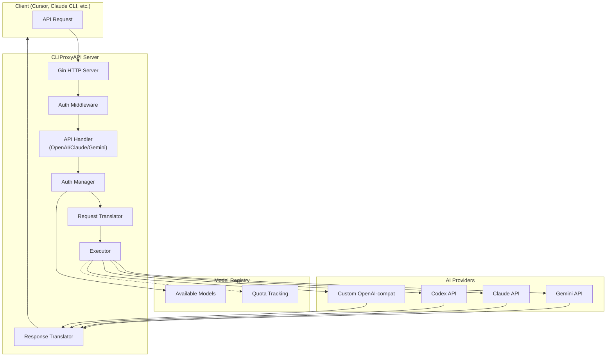

# CLIProxyAPI - Project Outline

> A comprehensive reference document for AI coding agents to quickly onboard to this project.

**Quick Links:**
- 📖 **Documentation**: [https://help.router-for.me/](https://help.router-for.me/)
- 🔗 **GitHub Repository**: [https://github.com/router-for-me/CLIProxyAPI](https://github.com/router-for-me/CLIProxyAPI)

---

## 1. Project Purpose

**CLIProxyAPI** is a **proxy server** that provides **OpenAI/Gemini/Claude/Codex-compatible API interfaces** for CLI-based AI tools. It enables:

- **Multi-provider access** through a unified API
- **OAuth-based authentication** for consumer AI subscriptions (Gemini, Claude, Codex, etc.)
- **Round-robin load balancing** across multiple accounts
- **API key pooling** for direct API credentials
- **Model aliasing and mapping** for flexibility

**Key Use Case**: Use your personal AI subscriptions (Google Gemini, Anthropic Claude, OpenAI Codex, etc.) with any OpenAI-compatible client, SDK, or coding tool.

---

## 2. Tech Stack

| Layer | Technology |
|-------|------------|
| Language | **Go 1.24+** |
| Web Framework | **Gin** (`github.com/gin-gonic/gin`) |
| Logging | **Logrus** (`github.com/sirupsen/logrus`) |
| Config | **YAML** (`gopkg.in/yaml.v3`) |
| JSON Path | **gjson/sjson** (`github.com/tidwall/gjson`, `github.com/tidwall/sjson`) |
| WebSocket | **Gorilla WebSocket** (`github.com/gorilla/websocket`) |
| OAuth | **golang.org/x/oauth2** |
| Token Storage | PostgreSQL, Git, MinIO Object Store, or Local Files |
| Build | Standard Go build, Docker support |

---

## 3. Project Structure

```
CLIProxyAPI/
├── cmd/server/                     # Entry point
│   └── main.go                     # Application startup, CLI flags, config loading
├── internal/                       # Private application code
│   ├── access/                     # Access control providers
│   ├── api/                        # HTTP API server
│   │   ├── handlers/               # Route handlers
│   │   │   └── management/         # Management API handlers
│   │   ├── middleware/             # HTTP middleware (auth, logging)
│   │   └── modules/                # Feature modules (Amp integration)
│   │       └── amp/                # Amp CLI integration module
│   ├── auth/                       # Authentication providers
│   │   ├── claude/                 # Claude OAuth
│   │   ├── codex/                  # Codex OAuth
│   │   ├── gemini/                 # Gemini (Google) OAuth
│   │   ├── iflow/                  # iFlow OAuth
│   │   ├── qwen/                   # Qwen OAuth
│   │   └── vertex/                 # Vertex AI service accounts
│   ├── cmd/                        # CLI command handlers (login flows)
│   ├── config/                     # Configuration loading/management
│   ├── constant/                   # Constants (provider names, etc.)
│   ├── interfaces/                 # Shared interfaces
│   ├── logging/                    # Logging infrastructure
│   ├── registry/                   # Model registry (availability tracking)
│   ├── runtime/                    # Runtime executors
│   │   ├── executor/               # Request execution engine
│   │   └── geminicli/              # Gemini CLI-specific runtime
│   ├── translator/                 # Request/Response translators
│   │   ├── antigravity/            # Antigravity provider
│   │   ├── claude/                 # Claude provider
│   │   ├── codex/                  # Codex provider
│   │   ├── gemini/                 # Gemini provider
│   │   ├── gemini-cli/             # Gemini CLI provider
│   │   ├── openai/                 # OpenAI provider
│   │   └── translator/             # Translator registry
│   ├── util/                       # Utility functions
│   ├── watcher/                    # File watching for hot-reload
│   └── wsrelay/                    # WebSocket relay
├── sdk/                            # Reusable SDK for embedding
│   ├── access/                     # Access provider SDK
│   ├── api/handlers/               # API handler SDK
│   │   ├── claude/                 # Claude handlers
│   │   ├── gemini/                 # Gemini handlers
│   │   └── openai/                 # OpenAI handlers
│   ├── auth/                       # Auth SDK
│   ├── cliproxy/                   # Core cliproxy service
│   │   ├── auth/                   # Auth manager
│   │   ├── executor/               # Executor interface
│   │   └── pipeline/               # Request pipeline
│   ├── config/                     # SDK config types
│   └── translator/                 # Translator SDK interface
├── config.yaml                     # Main configuration file
├── config.example.yaml             # Configuration template
├── auths/                          # OAuth token storage directory
├── start.sh                        # Development startup script
├── notes/                          # Documentation & notes
└── docs/                           # SDK documentation
```

---

## 4. Architecture Overview

### 4.1 Request Flow



### 4.2 Core Components

| Component | Location | Purpose |
|-----------|----------|---------|
| **HTTP Server** | `internal/api/server.go` | Gin-based server with routes for OpenAI/Gemini/Claude APIs |
| **API Handlers** | `sdk/api/handlers/` | Process incoming requests (chat completions, models, etc.) |
| **Auth Manager** | `sdk/cliproxy/auth/` | Manages authentication providers, token refresh, load balancing |
| **Translators** | `internal/translator/` | Convert between API formats (e.g., OpenAI→Gemini) |
| **Model Registry** | `internal/registry/` | Track available models with reference counting |
| **Executors** | `internal/runtime/executor/` | Execute HTTP requests to upstream providers |
| **Config** | `internal/config/` | YAML config loading with hot-reload |
| **Watcher** | `internal/watcher/` | File watching for auth token changes |

---

## 5. Data Flow

### 5.1 Incoming Request Processing

1. **HTTP Request** arrives at Gin router
2. **Auth Middleware** validates API key or passes through
3. **Handler** parses request, extracts model name
4. **Auth Manager** selects a credential (round-robin with quota awareness)
5. **Request Translator** converts to provider's native format
6. **Executor** sends request to upstream API
7. **Response Translator** converts response back to client format
8. **Stream/Return** response to client

### 5.2 Authentication Flow

```
OAuth Login (e.g., --claude-login)
    │
    ▼
Browser Opens → User Logs In
    │
    ▼
OAuth Callback → Token Saved to auth-dir
    │
    ▼
Watcher Detects New Token
    │
    ▼
Auth Manager Registers Provider
    │
    ▼
Model Registry Updated with Available Models
```

### 5.3 Translator Pattern

Translators convert between API formats using a **registry pattern**:

```go
// internal/translator/init.go - Imports trigger registration
import (
    _ "internal/translator/claude/gemini"           // Claude → Gemini
    _ "internal/translator/codex/openai/chat-completions"  // Codex → OpenAI
    _ "internal/translator/antigravity/openai/chat-completions"
)

// Each translator registers itself in init()
func init() {
    translator.Register(
        OpenAI,              // Source format
        Antigravity,         // Target provider
        ConvertRequest,      // Request translator function
        interfaces.TranslateResponse{
            Stream:    ConvertStreamResponse,
            NonStream: ConvertNonStreamResponse,
        },
    )
}
```

---

## 6. Configuration

### 6.1 Main Config (`config.yaml`)

```yaml
# Server
host: ""                    # Bind address (empty = all interfaces)
port: 8317                  # HTTP port

# Authentication
auth-dir: "~/.cli-proxy-api"  # OAuth tokens directory
api-keys:                     # Client API keys for auth middleware
  - "your-api-key"

# Provider Credentials
gemini-api-key:              # Direct Gemini API keys
  - api-key: "AIzaSy..."
    prefix: "team-a"         # Optional namespace

claude-api-key:              # Direct Claude API keys
  - api-key: "sk-..."
    base-url: "https://api.anthropic.com"

openai-compatibility:        # Third-party OpenAI-compatible
  - name: "openrouter"
    base-url: "https://openrouter.ai/api/v1"
    api-key-entries:
      - api-key: "sk-or-..."
    models:
      - name: "actual-model-name"
        alias: "user-facing-name"

# Behavior
request-retry: 3             # Retry count on errors
quota-exceeded:
  switch-project: true       # Auto-switch on quota exceeded
debug: false                 # Debug logging
```

### 6.2 Environment Variables

| Variable | Purpose |
|----------|---------|
| `MANAGEMENT_PASSWORD` | Management API authentication |
| `PGSTORE_DSN` | PostgreSQL token store connection |
| `GITSTORE_GIT_URL` | Git-based token store repository |
| `OBJECTSTORE_ENDPOINT` | MinIO/S3 object store endpoint |
| `DEPLOY=cloud` | Cloud deployment mode |

---

## 7. Code Style & Conventions

### 7.1 General Go Style

- **Standard Go formatting** (`gofmt`)
- **Package-level documentation** at top of each `.go` file
- **Interface-based design** for extensibility
- **Context propagation** throughout async operations
- **Error wrapping** with `fmt.Errorf("context: %w", err)`

### 7.2 Package Structure

```go
// Package api provides the HTTP API server implementation for CLI Proxy API.
// It includes the main server struct, routing setup, middleware for CORS and auth,
// and integration with various AI API handlers.
package api
```

### 7.3 Naming Conventions

| Type | Convention | Example |
|------|------------|---------|
| Packages | lowercase, single word | `translator`, `registry` |
| Exported types | PascalCase | `ModelRegistry`, `BaseAPIHandler` |
| Unexported | camelCase | `applyAccessConfig`, `handleAuthUpdate` |
| Constants | PascalCase | `OpenAI`, `Claude`, `Gemini` |
| Interfaces | Descriptive, often `-er` | `RequestLogger`, `TokenStore` |

### 7.4 Error Handling

```go
// Standard pattern: return early on errors
if err := doSomething(); err != nil {
    return fmt.Errorf("failed to do something: %w", err)
}

// API errors use structured types
type ErrorResponse struct {
    Error ErrorDetail `json:"error"`
}

type ErrorDetail struct {
    Message string `json:"message"`
    Type    string `json:"type"`
    Code    string `json:"code,omitempty"`
}
```

### 7.5 Initialization Pattern

Translators and providers use **init() registration**:

```go
package chat_completions

func init() {
    translator.Register(
        constant.OpenAI,        // Source
        constant.Antigravity,   // Target
        ConvertRequest,         // Request translator
        interfaces.TranslateResponse{
            Stream:    ConvertStreamResponse,
            NonStream: ConvertNonStreamResponse,
        },
    )
}
```

---

## 8. Key Files Reference

| File | Purpose |
|------|---------|
| `cmd/server/main.go` | Entry point, CLI flags, config loading |
| `internal/api/server.go` | HTTP server setup, all API routes |
| `internal/config/config.go` | Config struct and YAML loading |
| `internal/translator/init.go` | Translator registration imports |
| `internal/registry/model_registry.go` | Model availability tracking |
| `sdk/cliproxy/service.go` | Core service lifecycle |
| `sdk/api/handlers/handlers.go` | Base API handler with execution |
| `config.example.yaml` | Complete config template |
| `start.sh` | Dev script (local build + ngrok) |

---

## 9. API Endpoints

### 9.1 OpenAI-Compatible Routes

| Method | Path | Handler |
|--------|------|---------|
| GET | `/v1/models` | List available models |
| POST | `/v1/chat/completions` | Chat completion |
| POST | `/v1/completions` | Legacy completion |
| POST | `/v1/messages` | Claude messages format |
| POST | `/v1/responses` | OpenAI responses format |

### 9.2 Gemini-Compatible Routes

| Method | Path | Handler |
|--------|------|---------|
| GET | `/v1beta/models` | List Gemini models |
| POST | `/v1beta/models/*action` | Generate content |
| GET | `/v1beta/models/*action` | Get model info |

### 9.3 Management API

| Method | Path | Purpose |
|--------|------|---------|
| GET | `/v0/management/config` | Get current config |
| PUT | `/v0/management/config.yaml` | Update config |
| GET | `/v0/management/usage` | Usage statistics |
| GET | `/v0/management/auth-files` | List auth tokens |
| POST | `/v0/management/auth-files` | Upload auth token |

---

## 10. Development Workflow

### 10.1 Running Locally

```bash
# Using brew-installed version
./start.sh

# Using local dev build (builds from source first)
./start.sh --local

# Direct Go run
go run ./cmd/server

# With specific config
go run ./cmd/server -config ./config.yaml
```

### 10.2 OAuth Login Flows

```bash
# Google/Gemini
./cli-proxy-api -login

# Claude
./cli-proxy-api -claude-login

# Codex (OpenAI)
./cli-proxy-api -codex-login

# Antigravity (Google DeepMind)
./cli-proxy-api -antigravity-login
```

### 10.3 Building

```bash
# Standard build
go build -o cli-proxy-api ./cmd/server

# Docker
docker build -t cliproxyapi .
```

---

## 11. Adding New Providers

### 11.1 Steps to Add a New Provider

1. **Add auth handler** in `internal/auth/<provider>/`
2. **Add translators** in `internal/translator/<provider>/`
   - `openai/chat-completions/` - For OpenAI-compatible clients
   - `gemini/` - For Gemini clients
   - `claude/` - For Claude clients
3. **Register translators** via blank import in `internal/translator/init.go`
4. **Add model definitions** in `internal/registry/model_definitions.go`
5. **Add config support** in `internal/config/config.go`

### 11.2 Translator Template

```go
// internal/translator/<provider>/openai/chat-completions/init.go
package chat_completions

import (
    . "internal/constant"
    "internal/interfaces"
    "internal/translator/translator"
)

func init() {
    translator.Register(
        OpenAI,                    // Input format
        YourProvider,              // Your provider constant
        ConvertRequest,            // Request conversion function
        interfaces.TranslateResponse{
            Stream:    ConvertStreamResponse,
            NonStream: ConvertNonStreamResponse,
        },
    )
}
```

---

## 12. Testing

```bash
# Run all tests
go test ./...

# Run specific package tests
go test ./internal/api/...

# With verbose output
go test -v ./internal/translator/...
```

---

## 13. Common Patterns

### 13.1 Streaming Response Pattern

```go
// SSE streaming response format
dataChan := make(chan []byte)
errChan := make(chan *interfaces.ErrorMessage)

go func() {
    defer close(dataChan)
    for chunk := range upstream {
        translated := translateChunk(chunk)
        dataChan <- translated
    }
}()

return dataChan, errChan
```

### 13.2 Model Registry Pattern

```go
// Register models when auth becomes available
registry.GetGlobalRegistry().RegisterClient(
    authID,        // Unique client/credential identifier
    "gemini",      // Provider name
    models,        // []*ModelInfo slice
)

// Unregister when auth is removed
registry.GetGlobalRegistry().UnregisterClient(authID)
```

### 13.3 Config Hot-Reload

The project watches for config changes and reloads without restart:
- Auth tokens in `auth-dir` are watched by `internal/watcher/`
- Config changes trigger `managementasset.StartAutoUpdater()`
- Model registry updates automatically

---

## 14. Troubleshooting

| Issue | Cause | Solution |
|-------|-------|----------|
| Models not showing | Auth token expired/missing | Re-run login flow |
| 403 errors | API key invalid or quota exceeded | Check credentials, wait for quota reset |
| Request timeout | Network/proxy issues | Check `proxy-url` config |
| Translator not found | Missing init() registration | Import in `internal/translator/init.go` |

---

## 15. Related Documentation

- 📖 **Official Docs**: [https://help.router-for.me/](https://help.router-for.me/)
- 🔗 **GitHub Repository**: [https://github.com/router-for-me/CLIProxyAPI](https://github.com/router-for-me/CLIProxyAPI)
- [README.md](../README.md) - Project overview
- [docs/sdk-usage.md](../docs/sdk-usage.md) - SDK usage guide
- [docs/sdk-advanced.md](../docs/sdk-advanced.md) - Advanced SDK topics
- [config.example.yaml](../config.example.yaml) - Full config reference
